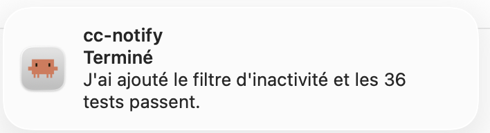
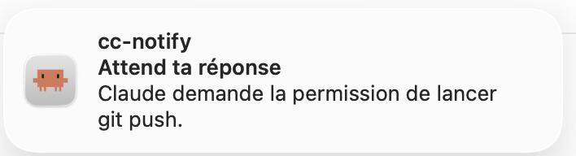
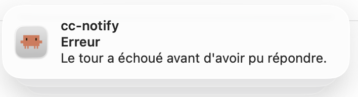

<div align="center">
  

  <h1>cc-notify</h1>

  <p>Des notifications macOS pour Claude Code, qui se taisent quand Claude va repartir tout seul.</p>

  <p>
    
    
    
    
  </p>

  <p><b>Français</b> · <a href="./README.md">English</a></p>
</div>

## Le problème

Quand plusieurs sessions Claude Code tournent en parallèle dans iTerm, plus rien ne dit
laquelle a rendu la main, laquelle pose une question et laquelle a planté. On surveille les
onglets à la main, ce qui revient à faire le travail d'un système de notifications.

Sauf qu'un système naïf est vite pire que rien. Notifier à chaque fin de tour ne sert à rien,
parce que Claude repart souvent tout seul, soit qu'un sous-agent travaille encore, soit qu'une
tâche de fond va le réveiller, soit qu'un `/loop` est programmé. Un outil qui sonne dans ces
moments-là finit désactivé au bout d'une journée. Tout l'intérêt de cc-notify tient donc dans
ce qu'il refuse d'afficher.

<p align="center">
  
  
</p>
<p align="center">
  
</p>

## Stack

Du Bash et rien d'autre, dans un fichier unique branché sur sept hooks de Claude Code, avec
`jq` pour lire les événements JSON et AppleScript pour parler à iTerm2. Le rendu passe par
alerter, un binaire signé qui sait afficher un champ de réponse dans la bannière, avec
`terminal-notifier` en repli. L'état vit dans `~/.claude/state/cc-notify/`, il est jetable, et
le système échoue toujours ouvert, ce qui veut dire qu'un hook cassé ne bloque jamais Claude
Code. L'escalade vers le téléphone s'appuie sur ntfy, qui est optionnel et désactivé par
défaut.

## Fonctionnalités

- Une bannière quand une session réclame vraiment votre attention, donc quand le tour est
  fini, quand une permission est demandée ou quand le tour a échoué.
- Un clic sur la bannière active la fenêtre iTerm concernée et sélectionne le bon onglet.
- Un champ de réponse directement dans la bannière, dont le texte part dans la session sans
  que vous ayez à quitter ce que vous faisiez.
- Cinq filtres qui décident du silence, et c'est le cœur du projet.
- Une escalade vers le téléphone si la bannière reste sans réaction, désactivée par défaut.
- Le nom du dépôt git en titre, ce qui dit laquelle de vos sessions vous appelle.

### Ce que dit la bannière

| Ligne | Contenu |
|---|---|
| Titre | le nom du dépôt git |
| Sous-titre | `Terminé`, `Attend ta réponse` ou `Erreur` |
| Corps | le dernier message de Claude, tronqué |

Le titre vient du dépôt git plutôt que du sujet de la conversation, parce qu'il reste stable
quand la discussion dérive. Hors dépôt, il retombe sur le nom de l'onglet iTerm, que Claude
Code tient à jour, puis sur le nom du dossier. Pour voir ce que donnerait un dossier donné,
`./cc-notify.sh --titre /chemin/du/projet` répond sans rien notifier.

Le champ de réponse n'apparaît que sur une fin de tour. Une demande de permission attend une
touche dans un sélecteur et pas du texte libre, donc y coller une phrase ferait n'importe quoi.

### Ce qui déclenche le silence

Rien ne s'affiche si vous regardez déjà cet onglet, si un sous-agent ou une tâche de fond
tourne encore, si un réveil est programmé par `/loop`, `ScheduleWakeup` ou `CronCreate`, ou
enfin si le tour a été court **et** que vous venez de toucher la machine.

Ce dernier filtre demande vraiment les deux conditions à la fois. Prises séparément, chacune
se trompe, puisqu'un tour court pendant votre absence mérite une notification et qu'un tour
long la mérite aussi même si vous tapez, parce que vous tapiez ailleurs. L'inactivité vient de
`HIDIdleTime`, le compteur système de dernière frappe ou de dernier mouvement de souris.

Une erreur de tour contourne tous ces filtres sauf le premier. Si la session est morte, elle ne
repartira pas toute seule, et il n'y a donc aucune raison de se taire.

## Installation

Il faut macOS, iTerm2 et Homebrew. `jq` et `osascript` sont déjà là.

```bash
brew install terminal-notifier librsvg
git clone https://github.com/Pomme978/cc-notify.git
cd cc-notify
./install.sh
```

`terminal-notifier` sert de repli et `librsvg` fournit `rsvg-convert`, qui fabrique l'icône à
partir du SVG. Le notifieur principal est alerter, le seul à savoir afficher un champ de
réponse. Comme il n'est pas dans Homebrew, `get-alerter.sh` va le chercher sur sa release
GitHub et refuse de l'installer si l'empreinte SHA-256 épinglée ou la signature Developer ID ne
correspondent pas. `install.sh` s'en charge tout seul. Sans lui tout fonctionne, mais les
bannières perdent leur champ de réponse.

L'installation est rejouable sans dommage. Elle fabrique l'icône et le bundle
`vendor/cc-notify.app` s'ils manquent, crée une dizaine de liens symboliques dans `~/.claude/hooks/`
pour que le code reste dans le dépôt, puis fusionne sept entrées `hooks` dans
`~/.claude/settings.json` en préservant tout le reste de votre configuration.

### Redémarrer Claude Code

C'est indispensable, parce que les hooks ne sont lus qu'au démarrage d'une session. Une session
déjà ouverte continuera de les ignorer, et c'est de très loin la première cause de « ça ne
filtre rien ». Un `/hooks` doit ensuite montrer les sept événements, à savoir
`UserPromptSubmit`, `SubagentStart`, `SubagentStop`, `PostToolUse`, `Stop`, `StopFailure` et
`Notification`.

### Autoriser les notifications

macOS ne crée l'entrée qu'après la première tentative d'envoi, il faut donc en provoquer une.

```bash
./vendor/cc-notify.app/Contents/MacOS/terminal-notifier \
  -title "Test" -message "Bonjour" -sound Ping
```

Puis dans Réglages Système, Notifications, **Claude Code**, autoriser les bannières et le son.
Relancer la commande confirme que c'est passé. L'entrée s'appelle « Claude Code » et non
« terminal-notifier » parce que les notifications sont émises depuis notre propre bundle, seule
façon d'afficher une icône personnalisée.

### Vérifier de bout en bout

Passer `DEBUG=1` dans `cc-notify.conf`, lancer une requête longue, passer sur une autre
application et attendre la fin. Une bannière doit apparaître et le clic doit ramener sur le bon
onglet. En relançant une requête longue tout en restant sur l'onglet, plus rien ne doit
apparaître, et `grep 'SKIP onglet-actif' ~/.claude/state/cc-notify/log` doit remonter une
ligne. Il ne reste qu'à remettre `DEBUG=0`.

### Désinstaller

```bash
./install.sh --uninstall
```

Les liens symboliques et le bloc `hooks` de `settings.json` sont retirés, les fichiers du
projet et l'état restent en place. L'entrée « Claude Code » subsiste dans les Réglages
Système, où elle disparaîtra d'elle-même.

## Réglages

Tout est dans `cc-notify.conf`, relu à chaque notification, donc rien n'est à redémarrer après
une modification. Les réglages personnels qui n'ont pas à partir dans git, comme le sujet ntfy,
vont dans `cc-notify.local.conf`, qui est ignoré par git et sourcé juste après.

| Clé | Défaut | Effet |
|---|---|---|
| `ENABLED` | `1` | `0` coupe tout sans désinstaller |
| `MIN_DURATION` | `30` | seuil de durée du tour, en secondes |
| `MIN_IDLE` | `30` | seuil d'inactivité de la machine, en secondes |
| `AGENT_TTL` | `600` | au-delà, un sous-agent muet est réputé mort |
| `BODY_LEN` | `120` | troncature du corps du message |
| `SOUND_DONE` | `Ping` | fin de tour |
| `SOUND_QUESTION` | `Glass` | question ou permission |
| `SOUND_ERROR` | `Basso` | erreur |
| `NTFY_TOPIC` | vide | sujet ntfy pour l'escalade, vide veut dire désactivé |
| `NTFY_SERVER` | `https://ntfy.sh` | serveur ntfy |
| `ESCALATE_AFTER` | `300` | délai avant escalade, en secondes |
| `DEBUG` | `0` | `1` journalise chaque événement et chaque décision |

Les sons disponibles sont les fichiers de `/System/Library/Sounds`.

## Tests

```bash
./test-cc-notify.sh
```

52 vérifications, sans aucun effet de bord, puisque le mode `--dry-run` imprime la décision au lieu de
notifier et que l'état est écrit dans un dossier temporaire.

## Documentation

| Fichier | Contenu |
|---|---|
| [`docs/conception.md`](./docs/conception.md) | la conception et ses arbitrages, donc pourquoi le compteur de tâches de fond n'est jamais décrémenté, pourquoi le système échoue ouvert, pourquoi `Stop` plutôt que `idle_prompt` |
| [`docs/escalade-ntfy.md`](./docs/escalade-ntfy.md) | l'escalade vers le téléphone, sa configuration et ce qu'elle expose |
| [`docs/icone.md`](./docs/icone.md) | comment l'icône et le bundle sont fabriqués, et pourquoi il faut un bundle |
| [`docs/gotchas.md`](./docs/gotchas.md) | les pièges déjà rencontrés, à lire quand quelque chose ne marche pas |

## Branches

| Branche | Rôle |
|---|---|
| `main` | la seule, et c'est tout ce dont un outil de cette taille a besoin |

## Auteurs

Conçu, designé et développé par **[Armand OCTEAU](https://github.com/Pomme978)** au sein de
[Solyzon](https://solyzon.com), à partir d'août 2026.

## Licence

Travail propriétaire. **Copyright (c) 2026 Armand OCTEAU. Tous droits réservés.**

Le code est publié en lecture seule, à titre de démonstration et de référence, ce qui ne vaut
pas cession de droits. Toute reproduction, redistribution, modification ou utilisation par un
tiers est interdite sans autorisation écrite préalable. Le détail est dans
[`LICENSE`](./LICENSE), qui précise aussi le sort des éléments tiers comme le glyphe de Claude
Code, qui appartient à Anthropic.

<div align="center">
  <br>
  <a href="https://solyzon.com">Solyzon</a>
  <p><sub>Conception et développement par Solyzon.</sub></p>
  <p><sub>© 2026 Armand OCTEAU. Tous droits réservés.</sub></p>
</div>
