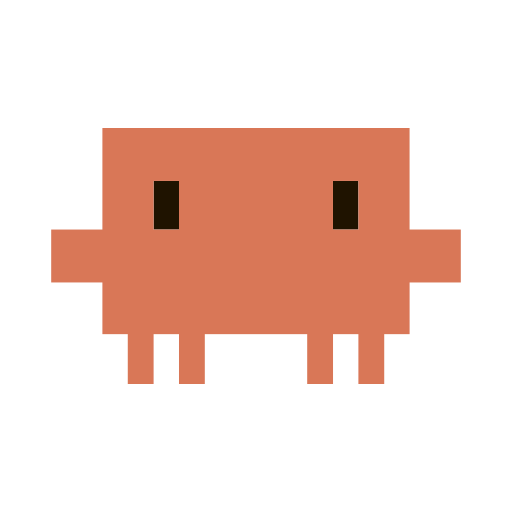

<div align="center">
  

  <h1>cc-notify</h1>

  <p>macOS notifications for Claude Code that stay quiet when Claude is about to keep going on its own.</p>

  <p>
    
    
    
    
  </p>

  <p><b>English</b> · <a href="./README.fr.md">Français</a></p>
</div>

## The problem

With several Claude Code sessions running side by side in iTerm, nothing tells you which one
handed control back, which one is asking a question and which one crashed. You end up watching
tabs by hand, which is exactly the job a notification system should be doing.

The catch is that a naive one is worse than nothing. Notifying on every finished turn is
useless, because Claude very often starts again by itself, either because a subagent is still
working, or because a background task will wake it up, or because a `/loop` is scheduled. A
tool that rings in those moments gets disabled within a day. So the whole point of cc-notify
is what it refuses to show.

<p align="center">
  
  
</p>
<p align="center">
  
</p>

> The banners are in French, which is the language of the machine they were captured on. The
> three state labels read `Terminé` (done), `Attend ta réponse` (waiting for you) and `Erreur`
> (error), and they live in `src/cc-notify.sh` if you want to change them.

## Stack

Bash and nothing else, in a single file wired to seven Claude Code hooks, with `jq` to read the
JSON events and AppleScript to talk to iTerm2. Rendering goes through alerter, a signed binary
that can show a reply field inside the banner, with `terminal-notifier` as a fallback. State
lives in `~/.claude/state/cc-notify/`, it is disposable, and the system always fails open,
meaning a broken hook can never block Claude Code. Escalation to your phone rides on ntfy,
which is optional and off by default.

## Features

- A banner when a session actually needs you, so when the turn is done, when a permission is
  requested, or when the turn failed.
- Clicking the banner activates the right iTerm window and selects the right session.
- A reply field inside the banner whose text goes straight into the session, without leaving
  whatever you were doing.
- Five filters that decide when to stay silent, which is the heart of the project.
- Escalation to your phone when a banner gets no reaction, off by default.
- The git repository name as the title, so you know which of your sessions is calling.

### What the banner says

| Line | Content |
|---|---|
| Title | the git repository name |
| Subtitle | `Terminé`, `Attend ta réponse` or `Erreur` |
| Body | Claude's last message, truncated |

The title comes from the git repository rather than from the conversation topic, because it
stays stable as the discussion drifts. Outside a repository it falls back to the iTerm tab
name, which Claude Code keeps up to date, then to the folder name. To see what a given folder
would produce, `./src/cc-notify.sh --titre /path/to/project` answers without notifying anything.

The reply field only shows up on a finished turn. A permission request expects a keystroke in a
picker rather than free text, so pasting a sentence into it would do something random.

### What triggers silence

Nothing shows up if you are already looking at that tab, if a subagent or a background task is
still running, if a wake-up is scheduled through `/loop`, `ScheduleWakeup` or `CronCreate`, or
finally if the turn was short **and** you have just touched the machine.

That last filter really does need both conditions at once. Taken separately each one gets it
wrong, since a short turn while you were away deserves a notification, and a long turn deserves
one too even if you are typing, because you were typing somewhere else. Idleness comes from
`HIDIdleTime`, the system counter of the last keystroke or mouse move.

A failed turn bypasses every filter except the first one. If the session is dead it will not
restart by itself, so there is no reason to stay quiet.

## Install

You need macOS, iTerm2 and Homebrew. `jq` and `osascript` are already there.

```bash
brew install terminal-notifier librsvg
git clone https://github.com/Pomme978/cc-notify.git
cd cc-notify
./install.sh
```

`terminal-notifier` is the fallback and `librsvg` provides `rsvg-convert`, which builds the
icon from the SVG. The main notifier is alerter, the only one that can show a reply field.
Since it is not in Homebrew, `scripts/get-alerter.sh` fetches it from its GitHub release and refuses to
install it unless the pinned SHA-256 and the Developer ID signature both match. `install.sh`
handles that on its own. Without it everything still works, but banners lose their reply field.

Installing is safe to repeat. It builds the icon and the `vendor/cc-notify.app` bundle if they
are missing, creates about ten symlinks in `~/.claude/hooks/` so the code stays inside the
repository, then merges seven `hooks` entries into `~/.claude/settings.json` while preserving
the rest of your configuration.

### Restart Claude Code

This is not optional, because hooks are only read when a session starts. An already open
session will keep ignoring them, and that is by far the first cause of "it filters nothing".
A `/hooks` should then list the seven events, namely `UserPromptSubmit`, `SubagentStart`,
`SubagentStop`, `PostToolUse`, `Stop`, `StopFailure` and `Notification`.

### Allow notifications

macOS only creates the entry after a first delivery attempt, so you have to force one.

```bash
./vendor/cc-notify.app/Contents/MacOS/terminal-notifier \
  -title "Test" -message "Hello" -sound Ping
```

Then in System Settings, Notifications, **Claude Code**, allow banners and sound. Running the
command again confirms it went through. The entry is called "Claude Code" and not
"terminal-notifier" because notifications are sent from our own bundle, which is the only way
to show a custom icon.

### Check it end to end

Set `DEBUG=1` in `config/cc-notify.conf`, start a long request, switch to another application and wait
for it to finish. A banner should appear and clicking it should bring you back to the right
tab. Starting another long request while staying on the tab should show nothing, and
`grep 'SKIP onglet-actif' ~/.claude/state/cc-notify/log` should return a line. Then set
`DEBUG=0` again.

### Uninstall

```bash
./install.sh --uninstall
```

The symlinks and the `hooks` block in `settings.json` are removed, while the project files and
the state stay where they are. The "Claude Code" entry remains in System Settings, where it
will disappear on its own.

## Settings

Everything lives in `config/cc-notify.conf`, which is re-read on every notification, so nothing needs
restarting after a change. Personal settings that should not end up in git, such as the ntfy
topic, go into `config/cc-notify.local.conf`, which git ignores and which is sourced right after.

| Key | Default | Effect |
|---|---|---|
| `ENABLED` | `1` | `0` turns everything off without uninstalling |
| `MIN_DURATION` | `30` | turn duration threshold, in seconds |
| `MIN_IDLE` | `30` | machine idle threshold, in seconds |
| `AGENT_TTL` | `600` | past this, a silent subagent is presumed dead |
| `BODY_LEN` | `120` | body truncation |
| `SOUND_DONE` | `Ping` | turn finished |
| `SOUND_QUESTION` | `Glass` | question or permission |
| `SOUND_ERROR` | `Basso` | error |
| `NTFY_TOPIC` | empty | ntfy topic for escalation, empty means disabled |
| `NTFY_SERVER` | `https://ntfy.sh` | ntfy server |
| `ESCALATE_AFTER` | `300` | delay before escalation, in seconds |
| `DEBUG` | `0` | `1` logs every event and every decision |

Available sounds are the files in `/System/Library/Sounds`.

## Tests

```bash
./tests/test-cc-notify.sh
```

52 checks with no side effect, since `--dry-run` prints the decision instead of notifying and
state is written to a temporary folder.

## Layout

```
src/        the hook and its satellites, one Bash file plus the AppleScripts
config/     cc-notify.conf, plus cc-notify.local.conf for what stays out of git
scripts/    icon and bundle building, and fetching alerter
tests/      the test harness
assets/     the source glyph, the generated icon and the logos
docs/       design, gotchas, screenshots
install.sh  symlinks and the merge into settings.json
vendor/     alerter and the .app bundle, rebuilt, never tracked by git
```

The code lives in the repository rather than in `~/.claude/`, so it survives a Claude Code
reinstall or a cleanup of the configuration folder. Only symlinks point from where Claude Code
expects to find it.

## Documentation

The documentation is written in French.

| File | Content |
|---|---|
| [`docs/conception.md`](./docs/conception.md) | the design and its trade-offs, so why the background task counter is never decremented, why the system fails open, why `Stop` rather than `idle_prompt` |
| [`docs/escalade-ntfy.md`](./docs/escalade-ntfy.md) | phone escalation, how to set it up and what it exposes |
| [`docs/icone.md`](./docs/icone.md) | how the icon and the bundle are built, and why a bundle is required |
| [`docs/gotchas.md`](./docs/gotchas.md) | problems already met, worth reading when something misbehaves |

## Branches

| Branch | Role |
|---|---|
| `main` | the only one, which is all a tool this size needs |

## Authors

Designed and built by **[Armand OCTEAU](https://github.com/Pomme978)** at
[Solyzon](https://solyzon.com), since August 2026.

## License

Proprietary work. **Copyright (c) 2026 Armand OCTEAU. All rights reserved.**

The code is published read only, as a demonstration and a reference, which grants no rights.
Any reproduction, redistribution, modification or third party use is forbidden without prior
written permission. The details are in [`LICENSE`](./LICENSE), which also covers third party
material such as the Claude Code glyph, which belongs to Anthropic.

<div align="center">
  <br>
  <a href="https://solyzon.com">
    <picture>
      <source media="(prefers-color-scheme: dark)" srcset="./assets/solyzon-on-dark.svg">
      
    </picture>
  </a>
  <p><sub>Designed and developed by Solyzon.</sub></p>
  <p><sub>© 2026 Armand OCTEAU. All rights reserved.</sub></p>
</div>
